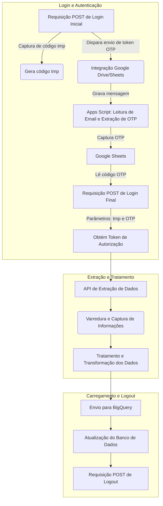

<!---
README do Projeto: Integração e Extração de Dados - Tiflux + Google Drive
-->

# Integração e Extração de Dados - Databricks + SISTEMA_WEB + Google Drive + Apps Script + Bigquery

## 📑 Índice

- [Resumo](#-resumo)
- [Bibliotecas Necessárias](#-bibliotecas-necessárias)
- [Integração com Google Drive](#-integração-com-google-drive)
- [Integração com o sistema WEB - Login e Autenticação](#-integração-com-sistema---login-e-autenticação)
- [Captura do Código OTP](#-captura-do-código-otp)
- [Validação da Sessão](#-validação-da-sessão)
- [Extração de Relatórios do Sistema](#-extração-de-relatórios-do-sistema)
- [Tratamento dos Dados](#-tratamento-dos-dados)
- [Observações](#-observações)
- [Autor](#-autor)

---

## 📄 Resumo

- Este projeto implementa uma solução de integração de dados com um sistema web. O fluxo automatizado inicia com o login automático no sistema, utilizando a interceptação da API e requisições POST para autenticação. Para sistemas com autenticação de dois fatores, o projeto captura o código mais recente enviado ao Gmail através da integração da API Gmail com Apps Script. Uma vez autenticado, os dados relevantes são extraídos do sistema web, transformados (ETL) e carregados para o BigQuery. Ao término da coleta de dados, o sistema realiza logout automático.
---

## 🔄 Fluxo do Processo



## 📚 Bibliotecas Necessárias

```bash
%pip install openpyxl google-auth google-auth-oauthlib google-auth-httplib2 google-api-python-client gspread drive pandas_gbq gspread_dataframe -q

````
### 🔐 Autenticação no Sistema WEB

**📂 Passos:**

- Importação das bibliotecas (`pandas`, `gspread`, `google-auth`, etc.)
- Autenticação com `service_account_file`
- Abertura da planilha pelo `spreadsheet_id`
- Seleção da aba (worksheet) **"Emails"**

### 🔐 Integração com Tiflux - Login e Autenticação

**🔄 Fluxo:**

- Busca do login e senha no `dbutils.secrets`
- Requisição `POST` para gerar o token temporário (`otp_tmp`)
- Atualização automática da planilha no Drive para capturar o OTP

``

### 🛡️ Captura do Código OTP

- Aguarda atualização da planilha
- Lê o código OTP de uma célula no Google Sheets

---

### ✅ Validação da Sessão

- Autenticação final usando `otp_tmp` + `otp`
- Captura do `authorization token` para autenticação nas APIs

---

### 🗃️ Extração de Relatórios do sistema

**🕒 Detalhes:**

- Define o período dos últimos 180 dias
- Pagina os resultados de tickets (controle de `offset`)
- Converte os dados para `DataFrame` com `pandas`

---

### 🛠️ Tratamento dos Dados

- Renomeia colunas
- Mapeia status de tickets
- Ajusta datas e horários para timezone `America/Sao_Paulo`

---

### 📝 Observações

- Fluxo totalmente automatizado para integração e extração de dados.

- Integração segura utilizando códigos OTP (Apis Interceptadas), App Script + google Sheets e API big query

### 👨‍💻 Autor

- **Nome:** Júlio Silva
- **Email:** juliocss044@gmail.com.br


