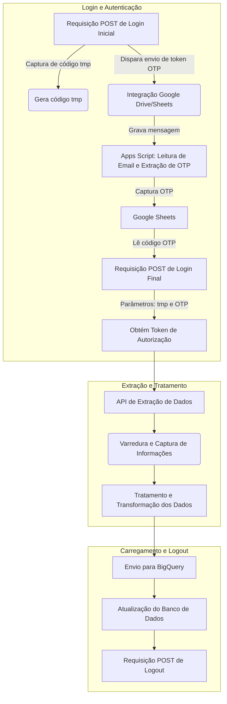

<!---
README do Projeto: Integração e Extração de Dados - Tiflux + Google Drive
-->

# Integração e Extração de Dados - Databricks + SISTEMA_WEB + Google Drive + Apps Script + Bigquery

## 📑 Índice

- [Resumo](#-resumo)
- [Bibliotecas Necessárias](#-bibliotecas-necessárias)
- [Integração com Google Drive](#-integração-com-google-drive)
- [Integração com o sistema WEB - Login e Autenticação](#-integração-com-sistema---login-e-autenticação)
- [Captura do Código OTP](#-captura-do-código-otp)
- [Validação da Sessão](#-validação-da-sessão)
- [Extração de Relatórios do Sistema](#-extração-de-relatórios-do-sistema)
- [Tratamento dos Dados](#-tratamento-dos-dados)
- [Observações](#-observações)
- [Autor](#-autor)

---

## 📄 Resumo

- Este projeto implementa uma solução de integração de dados com um sistema web. O fluxo automatizado inicia com o login automático no sistema, utilizando a interceptação da API e requisições POST para autenticação. Para sistemas com autenticação de dois fatores, o projeto captura o código mais recente enviado ao Gmail através da integração da API Gmail com Apps Script. Uma vez autenticado, os dados relevantes são extraídos do sistema web, transformados (ETL) e carregados para o BigQuery. Ao término da coleta de dados, o sistema realiza logout automático.
---

## 🔄 Fluxo do Processo



## 📚 Bibliotecas Necessárias

```bash
%pip install openpyxl google-auth google-auth-oauthlib google-auth-httplib2 google-api-python-client gspread drive pandas_gbq gspread_dataframe -q

````
### 🔐 Autenticação no Sistema WEB

**📂 Passos:**

O processo inicia com uma requisição POST para o sistema web. Nesta etapa, são capturados dois elementos cruciais:
*  O **código temporário (`tmp`)**, um código alfanumérico necessário para a segunda parte do login.
*  É realizado pelo sistema o disparo automático de um **código OTP** (token de acesso de uso único) para o e-mail do usuário.
---
### 🔐 Captura do Código OTP via Google Sheets e Apps Script

**🔄 Fluxo:**
Uma integração com o Google Drive e Google Sheets é ativada. Ao receber uma notificação, um App Script é acionado para:
*  Integrar com o e-mail do usuário.
*  Ler o e-mail mais recente da notificação do token.
*  Extrair o **código OTP** contido na mensagem.
*  Gravar o código na planilha do Google Sheets para uso posterior.
---
### 🛡️ Captura do Código OTP

- Aguarda atualização da planilha.
- Lê o código OTP de uma célula no Google Sheets via integração com o drive.
---

### ✅ Login Final e Obtenção do Token de Seção

Nesta etapa, fazemos uma requisição de login, utilizando os códigos capturados nas etapas anteriores como parâmetros:
1.  O **código `tmp`**.
2.  O **código OTP**.
3.  A requisição retorna o **token de autorização de sessão ativa**, que será utilizado para todas as interações futuras com a API do sistema.
* O capturamos através dos headers da API, fazendo um response.headers['authorization], ação a qual exibirá o token, assim o armazenamentos em uma variável deixando-o dinâmico.
```bash
token = response.headers['authorization]
````
---

### 🗃️ Extração de Relatórios do sistema

**🕒 Detalhes:**

- Com o token de autorização em mãos, o processo realiza chamadas à API do sistema para capturar os dados priorizados.
- Define o período dos últimos 180 dias
- Pagina os resultados de tickets (controle de `offset`)
- Converte os dados para `DataFrame` com `pandas`
---

### 🛠️ Tratamento dos Dados

- Renomeia colunas
- Mapeia status de tickets
- Ajusta datas e horários para timezone `America/Sao_Paulo`

---

### 📝 Envio para o BigQuery e Logout

- Os dados tratados então são enviados para o BigQuery, atualizando o banco de dados.
- Em seguida para garantir a segurança e liberar a sessão, uma requisição POST de logout é realizada automaticamente, encerrando o processo de execução do script e finalizando a automação.
---

### 👨‍💻 Contato

- **Nome:** Júlio Silva
- **Email:** <a href="mailto:juliocss044@gmail.com.br">juliocss044@gmail.com.br</a>


